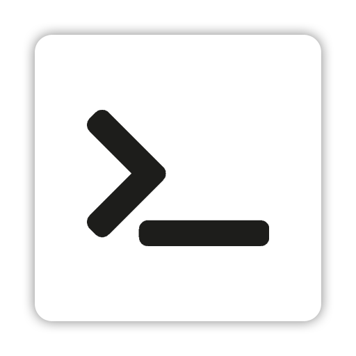
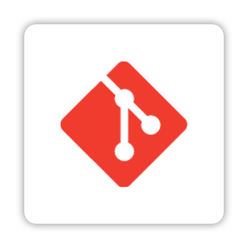

# Dotfiles and Configs

A collection of my templates, configuration files, dotfiles, and settings for a variety of tools and applications.

 

<!-- Tiles for tools and applications -->

  <!-- Zsh -->
  
  <!-- Git -->
  
  <!-- VS Code -->
  
  <!-- npm -->
  
  <!-- Typescript -->
  

